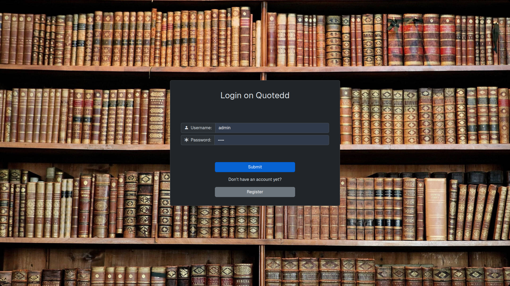

# Quotedd

## Index

- [Summary](#summary)
- [Screenshots](#screenshots)
- [Installation](#installation)
- [Bundled Database](#bundled-database)
- [Secret Key](#secret-key)

## Summary

Quotedd is a Web Application where you can share your favorite Quotes.

You can:

- Publish Quotes, indicating their Book and Author
- Create QuoteLists, saving your favorite Quotes found on Quotedd
- Edit and Delete your Quotes and Quotelists
- Comment on other people's Quotes
- Search and filter your results

## Screenshots




## Installation

1. You need to install Redis

    Arch:

    ```bash
    sudo pacman -Sy redis
    ```

2. Run redis

    ```bash
    redis-server
    ```

3. Install python dependencies

   Requirements.txt found in `src/requirements.txt`

    ```bash
    pip install -r requirements.txt
    ```

4. Run Flask inside `src/`

    ```bash
    flask run
    ```

## Bundled Database

The application comes bundled with a `dump.rdb` file. It includes a bunch of quotes and lists. If you don't want to use it you can delete the file.

**Usernames : Passwords** in bundled `dump.rdb`:

- user : user
- admin : admin

## Secret Key

The application uses the Secret Key found in `src/instance/config.json` to apply its encryption algorithms. You should generate a new key. You can put any content as the Secret Key.
