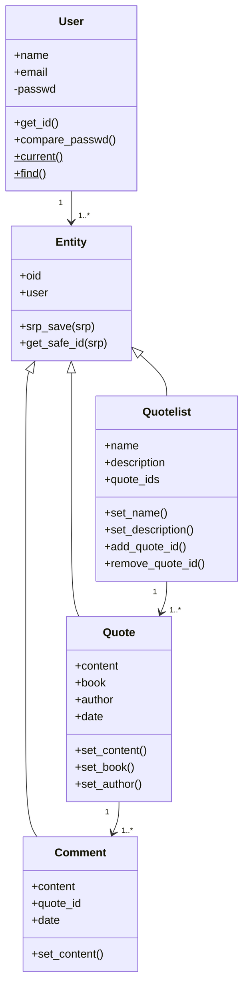

# Diagrama de Clases

```mermaid
classDiagram
    class User {
        +name
        +email
        -passwd
        +get_id()
        +compare_passwd()
        +current()$
        +find()$
    }
    class Entity {
        +oid
        +user
        +srp_save(srp)
        +get_safe_id(srp)
    }
    class Quote {
        +content
        +book
        +author
        +date
        +set_content()
        +set_book()
        +set_author()
    }
    class Quotelist {
        +name
        +description
        +quote_ids
        +set_name()
        +set_description()
        +add_quote_id()
        +remove_quote_id()
    }
    class Comment {
        +content
        +quote_id
        +date
        +set_content()
    }
    Entity <|-- Quote
    Entity <|-- Quotelist
    Entity <|-- Comment
    User "1" --> "1..*" Entity
    Quotelist "1" --> "1..*" Quote
    Quote "1" --> "1..*" Comment

```
