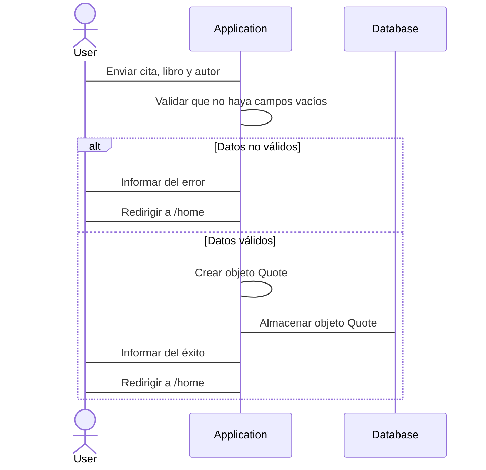

# Diagrama de Secuencia

## Quote · Add

```mermaid
sequenceDiagram
    actor User
    participant Application
    participant Database
    User -> Application: Enviar cita, libro y autor
    Application -> Application: Validar que no haya campos vacíos
    alt Datos no válidos
        Application -> User: Informar del error
        Application -> User: Redirigir a /home
    else Datos válidos
        Application -> Application: Crear objeto Quote
        Application -> Database: Almacenar objeto Quote
        Application -> User: Informar del éxito
        Application -> User: Redirigir a /home
    end
```
