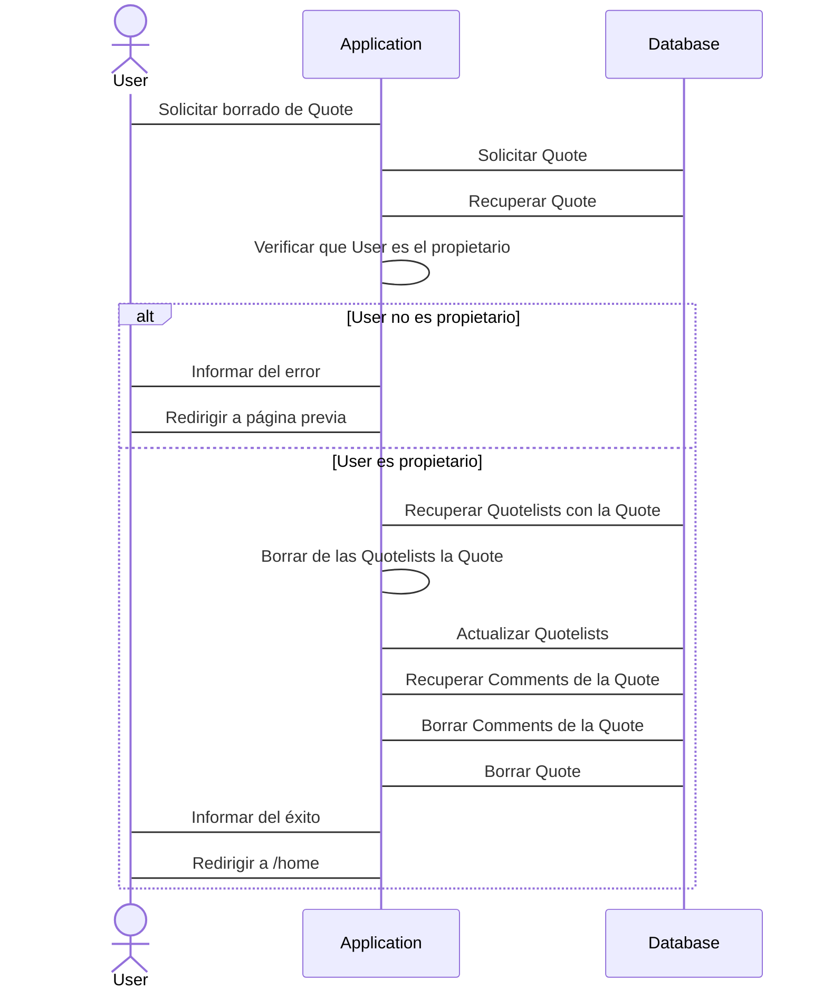

# Diagrama de Secuencia

## Quote · Delete

```mermaid
sequenceDiagram
    actor User
    participant Application
    participant Database
    User -> Application: Solicitar borrado de Quote
    Application -> Database: Solicitar Quote
    Database -> Application: Recuperar Quote
    Application -> Application: Verificar que User es el propietario 
    alt User no es propietario
        Application -> User: Informar del error
        Application -> User: Redirigir a página previa
    else User es propietario
        Application -> Database: Recuperar Quotelists con la Quote
        Application -> Application: Borrar de las Quotelists la Quote
        Application -> Database: Actualizar Quotelists
        Application -> Database: Recuperar Comments de la Quote
        Application -> Database: Borrar Comments de la Quote
        Application -> Database: Borrar Quote
        Application -> User: Informar del éxito
        Application -> User: Redirigir a /home
    end
```
