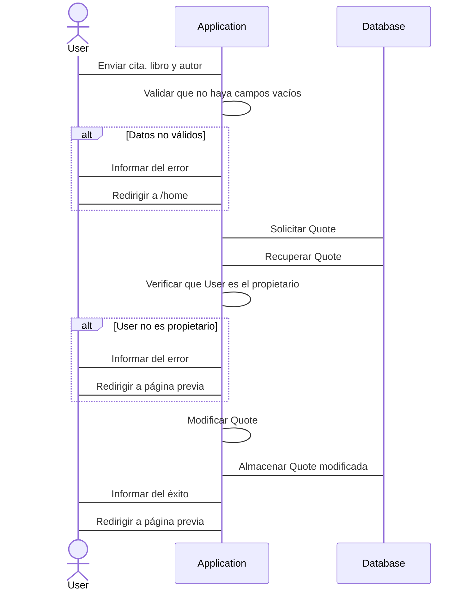

# Diagrama de Secuencia

## Quote · Edit

```mermaid
sequenceDiagram
    actor User
    participant Application
    participant Database
    User -> Application: Enviar cita, libro y autor
    Application -> Application: Validar que no haya campos vacíos
    alt Datos no válidos
        Application -> User: Informar del error
        Application -> User: Redirigir a /home
    end
    Application -> Database: Solicitar Quote
    Database -> Application: Recuperar Quote
    Application -> Application: Verificar que User es el propietario
    alt User no es propietario
        Application -> User: Informar del error
        Application -> User: Redirigir a página previa
    end
    Application -> Application: Modificar Quote
    Application -> Database: Almacenar Quote modificada
    Application -> User: Informar del éxito
    Application -> User: Redirigir a página previa
```
