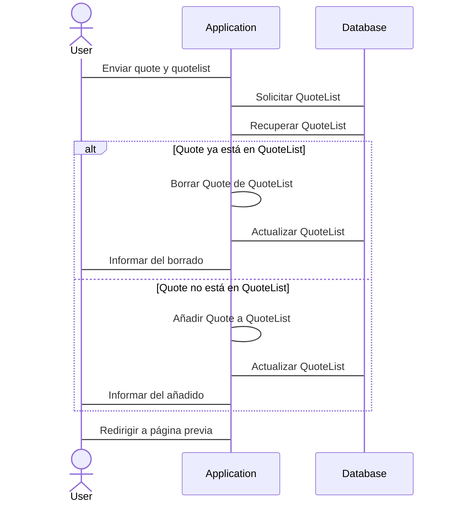

# Diagrama de Secuencia

## QuoteList · Add Quote

```mermaid
sequenceDiagram
    actor User
    participant Application
    participant Database
    User -> Application: Enviar quote y quotelist
    Application -> Database: Solicitar QuoteList
    Database -> Application: Recuperar QuoteList
    alt Quote ya está en QuoteList
        Application -> Application: Borrar Quote de QuoteList
        Application -> Database: Actualizar QuoteList
        Application -> User: Informar del borrado
    else Quote no está en QuoteList
        Application -> Application: Añadir Quote a QuoteList
        Application -> Database: Actualizar QuoteList
        Application -> User: Informar del añadido
    end
    Application -> User: Redirigir a página previa
```
